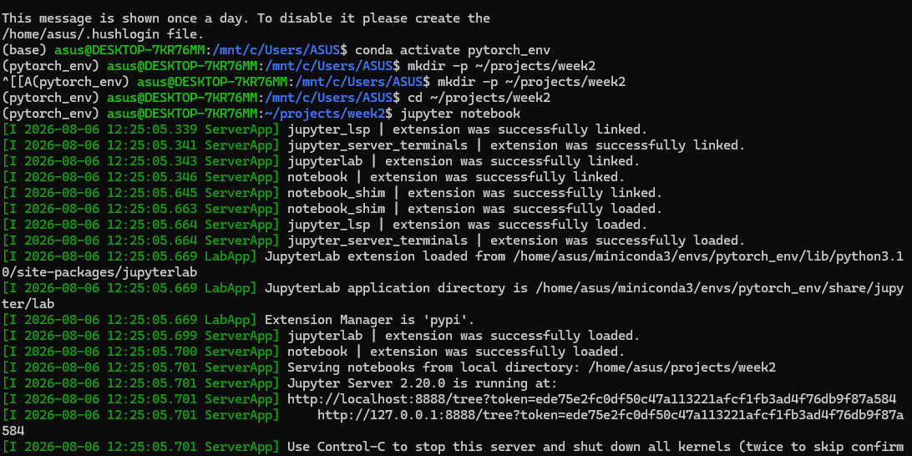
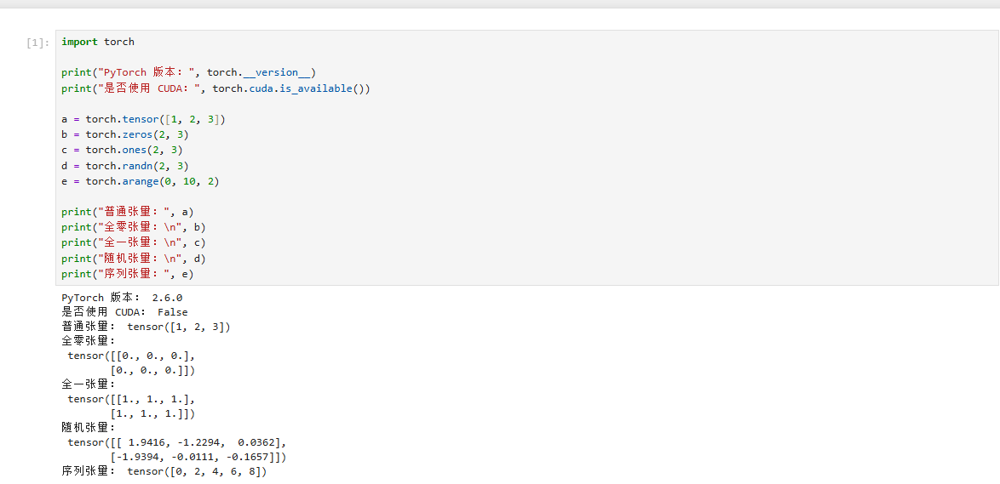

# 第二周学习笔记：开发环境配置与 PyTorch 入门

## 一、本周任务

本周主要完成以下内容：

1. 安装并配置 WSL2 与 Ubuntu。
2. 安装 Miniconda 并创建 PyTorch 虚拟环境。
3. 配置 Jupyter Notebook 和 VS Code。
4. 学习 PyTorch 张量的创建与基本操作。
5. 学习 PyTorch 自动微分机制。
6. 将学习笔记、代码和环境验证截图上传至代码仓库。

## 二、开发环境

本次学习使用的开发环境如下：

- 操作系统：Windows + WSL2
- Linux 发行版：Ubuntu
- Python 环境管理：Miniconda
- Conda 环境名称：`pytorch_env`
- 编辑器：Visual Studio Code
- 交互式开发工具：Jupyter Notebook
- 深度学习框架：PyTorch
- Notebook 内核：`Python (pytorch_env)`

## 三、目录结构

```text
week2/
├── images/
│   ├── pytorch验证.png
│   └── wsl环境验证.png
├── python-autograd.ipynb
└── README.md
```

文件说明：

- `images/wsl环境验证.png`：WSL2 和 Ubuntu 环境运行截图。
- `images/pytorch验证.png`：PyTorch 版本、张量创建及运行结果截图。
- `python-autograd.ipynb`：PyTorch 张量与自动微分实操笔记。
- `README.md`：第二周任务的总结说明。

## 四、环境验证

### 1. WSL2 环境验证

成功进入 Ubuntu，并能够在 WSL2 中运行 Linux 命令。



### 2. PyTorch 环境验证

在 `pytorch_env` 环境中成功导入 PyTorch，并完成版本号输出和张量创建。



PyTorch 验证代码示例：

```python
import torch

print("PyTorch版本：", torch.__version__)

x = torch.tensor([[1, 2], [3, 4]], dtype=torch.float32)

print("创建的张量：")
print(x)
print("张量形状：", x.shape)
print("张量数据类型：", x.dtype)
```

## 五、自动微分实验

PyTorch 的自动微分功能可以自动计算函数中各个变量的梯度。

实验代码：

```python
import torch

# 创建需要计算梯度的张量
x = torch.tensor(3.0, requires_grad=True)

# 定义函数 y = x² + 2x + 1
y = x ** 2 + 2 * x + 1

# 反向传播，计算梯度
y.backward()

print("x =", x.item())
print("y =", y.item())
print("x的梯度 =", x.grad.item())
```

函数为：

```text
y = x² + 2x + 1
```

对 `x` 求导：

```text
dy/dx = 2x + 2
```

当 `x = 3` 时：

```text
dy/dx = 2 × 3 + 2 = 8
```

程序输出的梯度为 `8`，与手动计算结果一致，说明 PyTorch 自动微分运行成功。

完整代码与运行结果见：

[查看 PyTorch 自动微分实操笔记](python-autograd.ipynb)

## 六、本周总结

通过本周学习，我完成了 WSL2、Miniconda、Jupyter Notebook、VS Code 和 PyTorch 的配置，并成功在 VS Code 中选择 `pytorch_env` 内核运行 Notebook。

同时，我学习了 PyTorch 张量的创建方法，理解了 `requires_grad=True`、`backward()` 和 `grad` 的基本作用，并通过实验验证了 PyTorch 的自动微分功能。