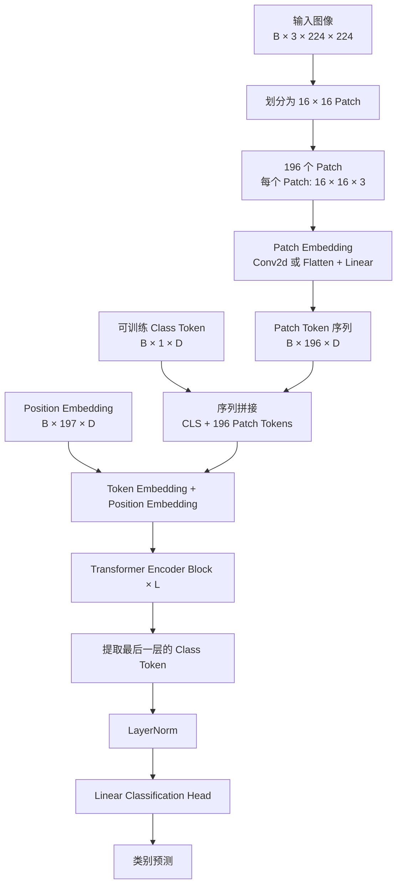
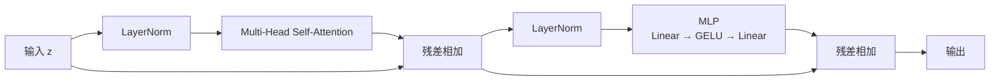

# ViT 论文精读学习笔记

> 论文：**An Image is Worth 16×16 Words: Transformers for Image Recognition at Scale**  
> 作者：Alexey Dosovitskiy 等，Google Research  
> 会议：ICLR 2021  
> 原论文：[arXiv PDF](https://arxiv.org/pdf/2010.11929)｜[HTML 版](https://arxiv.org/html/2010.11929v2)｜[官方代码](https://github.com/google-research/vision_transformer)

## 1. ViT 要解决什么问题

Transformer 在自然语言处理中把文本表示成 token 序列。ViT 的基本问题是：**能否把图像也转换成 token 序列，然后直接使用标准 Transformer Encoder 进行图像识别？**

最直接的想法是把每个像素当作一个 token，但这样会产生非常长的序列。例如，一张 `224×224` 图像包含：

$$
224\times224=50,176
$$

个像素 token。Self-Attention 的时间和空间复杂度与 token 数量的平方相关：

$$
O(N^2)
$$

像素级 Attention 矩阵约有：

$$
50,176^2\approx25.2\text{ 亿个元素}
$$

计算成本过高，因此 ViT 不把单个像素作为 token，而是把一块图像 Patch 作为 token。

---

## 2. ViT 的核心创新

ViT 最核心的创新可以概括为：

> 将图像切分为固定大小的 Patch，把每个 Patch 映射为一个向量，并把这些向量作为 token 序列输入标准 Transformer Encoder。

以 `224×224` 的 RGB 图像和 `16×16` Patch 为例：

$$
N=\frac{224}{16}\times\frac{224}{16}=14\times14=196
$$

因此，图像从 50,176 个像素位置变成 196 个 Patch token。Attention 矩阵变成：

$$
196^2=38,416
$$

相对于逐像素 Attention，矩阵元素数量减少约：

$$
\left(\frac{50,176}{196}\right)^2=65,536
$$

倍。

ViT 的贡献不只是“切 Patch”，还包括：

1. 证明标准 Transformer Encoder 几乎无需修改就可以处理图像。
2. 使用可训练的 Class Token 汇总整张图像的信息。
3. 使用 Position Embedding 保留 Patch 的位置信息。
4. 证明当预训练数据足够大时，较少依赖 CNN 视觉先验的纯 Transformer 也能获得很强的图像识别能力。

---

## 3. ViT 模型架构图



单个 Transformer Encoder Block：



ViT 使用的是 **Pre-LayerNorm**：LayerNorm 位于 Attention 和 MLP 之前。

---

## 4. 完整张量变化

假设使用 ViT-B/16：

- 输入分辨率：`224×224`
- Patch 大小：`16×16`
- 通道数：`3`
- Embedding 维度：`768`
- Patch 数量：`196`

张量变化如下：

| 阶段 | 张量形状 | 含义 |
|---|---|---|
| 输入图像 | `[B, 3, 224, 224]` | B 张 RGB 图像 |
| Patch 投影 | `[B, 768, 14, 14]` | 每个 Patch 映射为 768 维 |
| 展平空间维度 | `[B, 768, 196]` | 14×14 变成 196 |
| 交换维度 | `[B, 196, 768]` | 196 个 Patch token |
| 加入 Class Token | `[B, 197, 768]` | 1 个 CLS + 196 个 Patch |
| 加入位置编码 | `[B, 197, 768]` | 注入位置信息 |
| Transformer 输出 | `[B, 197, 768]` | 每个 token 得到上下文表示 |
| 读取 CLS | `[B, 768]` | 整张图像的表示 |
| 分类头 | `[B, num_classes]` | 各类别 logits |

---

## 5. Patch Embedding

### 5.1 原论文的表示

一个 RGB Patch 的大小为 `P×P×C`。将它展平后得到：

$$
x_p^i\in\mathbb{R}^{P^2C}
$$

再通过一个可学习矩阵映射到 Transformer 的隐藏维度 `D`：

$$
x_p^iE,\qquad E\in\mathbb{R}^{(P^2C)\times D}
$$

### 5.2 为什么可以使用 Conv2d

工程中通常使用：

```python
nn.Conv2d(
    in_channels=3,
    out_channels=embed_dim,
    kernel_size=patch_size,
    stride=patch_size,
)
```

其中：

- `kernel_size=P`：一次覆盖一个完整 Patch；
- `stride=P`：每次移动一个 Patch，Patch 之间不重叠；
- `out_channels=D`：每个 Patch 输出 D 个数，形成 D 维 token。

因此，下面两个操作在数学上等价：

```text
提取 Patch → 展平 → 同一个 Linear
```

```text
Conv2d(kernel_size=P, stride=P)
```

最小实现：

```python
class PatchEmbedding(nn.Module):
    def __init__(self, patch_size=16, embed_dim=768):
        super().__init__()
        self.projection = nn.Conv2d(
            3,
            embed_dim,
            kernel_size=patch_size,
            stride=patch_size,
        )

    def forward(self, x):
        x = self.projection(x)       # [B, D, H/P, W/P]
        x = x.flatten(2)             # [B, D, N]
        x = x.transpose(1, 2)        # [B, N, D]
        return x
```

---

## 6. Class Token

Class Token 是一个不对应任何实际图像区域的可训练向量：

```python
self.class_token = nn.Parameter(torch.zeros(1, 1, embed_dim))
```

它被放到 Patch 序列的最前面：

```text
[CLS, Patch1, Patch2, ..., Patch196]
```

在多层 Self-Attention 中，Class Token 可以与所有 Patch 交换信息，从而逐渐汇总整张图像的内容。最终分类器读取最后一层的 Class Token：

```python
image_feature = tokens[:, 0]
logits = classifier(image_feature)
```

可以将 Class Token 理解成整张图像的“信息汇总位置”，但它不是人工设定的平均池化；如何汇总信息是训练出来的。

---

## 7. Position Embedding

Self-Attention 本身不会自动知道 token 的排列位置。如果只给出 Patch 内容，模型无法仅根据 Attention 区分某个 Patch 位于左上角还是右下角。

ViT 因此为 Class Token 和每个 Patch 添加可学习的位置向量：

```python
self.position_embedding = nn.Parameter(
    torch.zeros(1, num_patches + 1, embed_dim)
)

x = x + self.position_embedding
```

Position Embedding 告诉模型“这是哪个序列位置”，但不会直接写明：

- 哪两个 Patch 相邻；
- 一个 Patch 是否在另一个 Patch 的左侧；
- 哪些 Patch 共同组成某个物体。

这些空间关系仍然需要模型通过数据和 Self-Attention 学习。

原始 ViT 使用可学习的一维位置编码。图像以固定顺序展开为 Patch 序列，因此序列位置与二维图像位置存在对应关系。

---

## 8. ViT 的核心公式

### 8.1 输入序列

$$
z_0=[x_{class};x_p^1E;x_p^2E;\cdots;x_p^NE]+E_{pos}
$$

含义：Patch 经过线性投影，前面加入 Class Token，然后整体加入 Position Embedding。

### 8.2 Multi-Head Self-Attention

$$
z'_l=\operatorname{MSA}(\operatorname{LN}(z_{l-1}))+z_{l-1}
$$

对应：

```python
x = x + attention(layer_norm(x))
```

### 8.3 MLP

$$
z_l=\operatorname{MLP}(\operatorname{LN}(z'_l))+z'_l
$$

对应：

```python
x = x + mlp(layer_norm(x))
```

### 8.4 图像表示

$$
y=\operatorname{LN}(z_L^0)
$$

其中，$z_L^0$ 是最后一层的第 0 个 token，即 Class Token。

---

## 9. ViT 与 CNN 的核心对比

| 对比项 | CNN | ViT |
|---|---|---|
| 基本输入单位 | 局部像素窗口 | 图像 Patch token |
| 核心操作 | 卷积 | Multi-Head Self-Attention |
| 感受野 | 从局部逐层扩大 | 一层即可建立全局关系 |
| 局部性 | 架构内置 | 主要从数据学习 |
| 平移等变性 | 卷积天然具备 | 不天然具备，需要学习 |
| 二维结构 | 强视觉先验 | 主要通过位置编码和数据学习 |
| 参数共享 | 卷积核在空间位置间共享 | Attention 和 MLP 参数共享，但位置处理不同 |
| 小数据表现 | 通常更好、样本效率高 | 原始 ViT 容易过拟合 |
| 大规模预训练 | 有效 | 尤其重要，扩展性较强 |
| 全局关系 | 需要堆叠多层扩大感受野 | Self-Attention 直接连接远距离 Patch |
| 计算特点 | 与卷积核和特征图相关 | Attention 对 token 数量是平方复杂度 |

### 9.1 为什么 CNN 在小数据上往往更好

CNN 把重要视觉规律直接写进了架构：

1. **局部性**：邻近像素通常更相关。
2. **平移等变性**：同一特征移动位置后仍可被相同卷积核检测。
3. **层次化结构**：浅层学习边缘和纹理，中层学习部件，深层学习完整物体。

这些视觉归纳偏置减少了模型需要从数据中学习的内容，因此 CNN 在小数据集上具有较高的样本利用效率。

### 9.2 为什么原始 ViT 更依赖大数据

ViT 的 Self-Attention 更自由，但缺少 CNN 强制加入的局部性和平移等变性。ViT 需要从数据中学习：

- 哪些 Patch 应当互相关注；
- 哪些局部结构构成纹理或部件；
- 不同位置、尺度和角度下哪些内容属于同一类别；
- 哪些远距离区域共同组成完整物体；
- 哪些背景信息应当忽略。

小数据下，这种灵活性可能导致模型没有学到稳定的视觉规律就发生过拟合。数据规模增大后，ViT 可以逐渐学习局部和全局关系，弥补视觉归纳偏置较弱的问题，从而发挥其表达能力和扩展能力。

可以记成：

> CNN 把视觉规律写进架构；ViT 更多地从数据中学习视觉规律。

---

## 10. Patch 大小与细节的权衡

Patch 越大：

- token 数量越少；
- Attention 计算量越低；
- Patch 内部细粒度空间结构越难被显式建模。

Patch 越小：

- token 数量越多；
- 能表示更细粒度的图像结构；
- Attention 计算量明显增加。

对于 `224×224` 图像：

| 模型形式 | Patch 数量 | Attention 矩阵大小 |
|---|---:|---:|
| ViT/32 | 7×7 = 49 | 49² = 2,401 |
| ViT/16 | 14×14 = 196 | 196² = 38,416 |
| ViT/8 | 28×28 = 784 | 784² = 614,656 |

因此，从 `/16` 改为 `/8`，token 数量增加 4 倍，而 Attention 矩阵大小增加约 16 倍。

Patch Embedding 是可训练投影，并不是简单平均，所以不会直接丢弃 Patch 中的全部信息。但后续 Transformer 主要把一个 Patch 当作一个 token，因此过大的 Patch 仍可能限制细小目标和 Patch 内空间结构的表达。

---

## 11. ViT、GPT-2 与 Transformer 的关系

| 对比项 | GPT-2 | ViT |
|---|---|---|
| 输入 | 文本 token | 图像 Patch token |
| 架构形式 | Decoder 风格 | Encoder |
| Attention 遮罩 | 使用因果遮罩，只看当前及过去 token | 不使用因果遮罩，Patch 之间全局可见 |
| 位置编码作用 | 表示文本顺序 | 表示 Patch 空间排列 |
| 特殊 token | 可能包含文本控制 token | 使用 Class Token 汇总图像 |
| 主要输出 | 下一个 token 的概率 | 图像类别 logits |

共同点是：二者都先把输入转换为一串向量，再利用 Self-Attention 建立 token 之间的关系。

---

## 12. 常见误区修正

### 误区一：ViT 在大数据上更强，是因为数据越多计算量越小

不正确。数据集越大，总训练计算量通常越大。ViT 在大规模数据上表现更好的主要原因是：足够多的数据使它能够学习原本没有内置在架构中的视觉规律。

### 误区二：ViT 的优势只是减少计算量

不准确。Patch 的确使全局 Attention 在图像上变得可行，但 ViT 相对于 CNN 不一定总是计算更少。ViT 的重要优势还包括全局关系建模、架构统一和良好的模型扩展能力。

### 误区三：小数据下 ViT 不如 CNN，主要因为 Patch 损失细节

Patch 过大确实可能损失细粒度结构，但原始 ViT 在小数据下表现较弱的核心原因是视觉归纳偏置较少，因此需要更多数据学习局部性、空间关系和平移不变规律。

### 误区四：Position Embedding 已经告诉模型所有空间关系

Position Embedding主要标识每个 Patch 的位置。邻接、方向、物体结构等复杂关系仍要通过训练学习。

### 误区五：Class Token 是所有 Patch 的简单平均

不是。Class Token 通过多层 Attention 动态地从其他 token 收集信息，信息汇总方式由训练决定。

---

## 13. 一句话总结各核心组件

- **Patch**：把图像转换成长度可控的 token 序列。
- **Patch Embedding**：把每个 Patch 映射成 Transformer 使用的 D 维向量。
- **Class Token**：在 Transformer 中汇总整张图像的信息，用于分类。
- **Position Embedding**：告诉模型每个 Patch 来自哪个位置。
- **Self-Attention**：学习 Patch 之间的局部和全局关系。
- **MLP**：对每个 token 的特征进行非线性变换。
- **残差连接与 LayerNorm**：帮助深层模型稳定训练。

整篇论文最值得记住的一句话：

> ViT 把图像切成 Patch token，并使用标准 Transformer Encoder 建模它们的关系；CNN 依靠架构内置的视觉规律，而 ViT 在更大程度上依靠数据学习这些规律。

